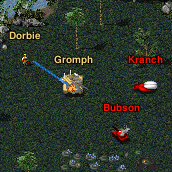

# renegade-2d
Git repository containing the Renegade 2D code and maps for OpenRA.

  

## Map links
The released maps are supported on OpenRA release-20200503.

Tiberian Dawn:
- Alpha (version 1.00): https://resource.openra.net/maps/35289/
- Bravo (version 1.00): https://resource.openra.net/maps/35290/
- Charlie (version 1.00): https://resource.openra.net/maps/35291/

Red Alert - none yet playable, work is in progress.

## Features
Gameplay is based on the first person shooter C&C Renegade, and is similar to its predecessor C&C Sole Survivor.

Gameplay features:
- Up to 24 players (12 vs 12).
- Control a single unit in a shared base with your team.
- Stand near base buildings to make purchases.
- Base buildings provide various benefits to your team.
- Vehicles require a pilot to be operated; many vehicles hold multiple passengers.
- Engineers can repair vehicles, buildings, and disarm beacons.
- Purchase beacons to call in a delayed superweapon strike.
- Gathered resources are distributed among your team; you have your own wallet.
- Earn $ for your team by purchasing a harvester and gathering resources.
- Earn $ by damaging or killing enemy units and structures.
- Win by destroying the enemy base!

It might crash, it might lag, and it's barely balanced!

There are several Lua hacks to make things work, and bugs.

## Repository structure
`lua` folder - Contains any scripts for running Renegade 2D. The script is mod-agnostic; it works for the CNC & RA mods, and can easily support future mods.

`mods/{mod}/rules` folder - Contains mod-specific rules for Renegade 2D

`mods/{mod}/maps` folder - Contains mod-specific maps for Renegade 2D

The maps in the `mods/{mod}/maps` folder only contain minimal custom yaml for Renegade 2D (player & team settings only).

## Building maps
To build maps for development, please see and use the `build-maps.ps1` script.